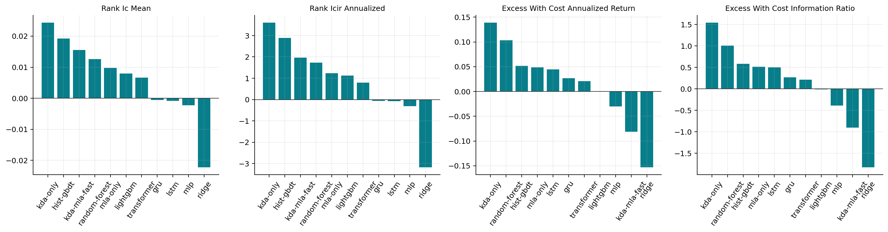
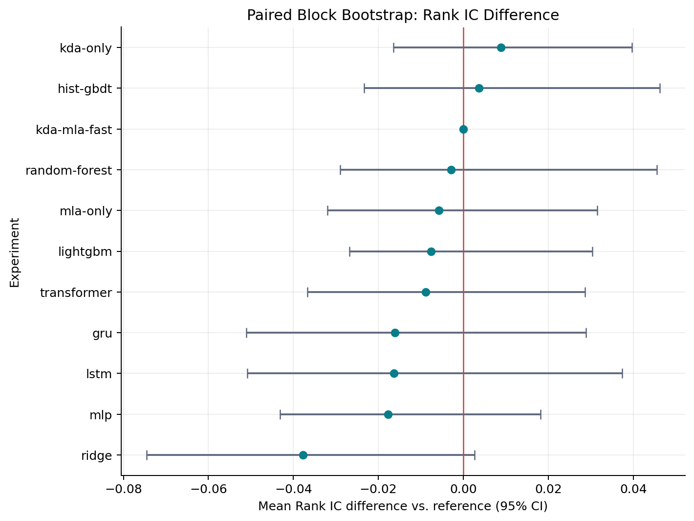

# KDA-MLA Stock

股票收益预测研究项目，使用 Kimi Delta Attention（KDA）与 Multi-head Latent Attention（MLA）
编码单只股票的历史 OHLCV 特征，并预测未来 5 个交易日收益。项目同时提供 sklearn 和 LightGBM
传统基线，以相同数据切分、Qlib 回测和统计检验进行公平比较。

项目默认使用真实 Qlib `CSI300` 时变成分股数据。合成数据仅用于检查代码能否运行，不应拿来判断策略有效性。

> 本项目用于模型和量化研究，不构成投资建议。测试集结果也不等于实盘收益。

## 模型概览

默认 `configs/model-small.json` 包含 12 层、384 隐藏维度的约 2218 万参数模型：

```text
OHLCV
  -> 10 个无未来信息的时序特征
  -> 线性特征投影
  -> 9 层 KDA + 3 层 MLA
  -> 最后一个交易日的时序状态
  -> 未来 5 日收益
  -> Rank IC / ICIR / 多空回测
```

KDA 负责用递归状态压缩长序列，MLA 在少量层中补充完整的因果注意力交互。该项目借用了 KDA 和 MLA
模块，不是 Kimi K3 的缩小版，也没有使用语言模型、Tokenizer 或文本预训练。

模型算法不重复造轮子：Ridge、Random Forest 和 HistGradientBoosting 直接使用 `scikit-learn`，
LightGBM 使用官方 `lightgbm`，KDA 正式训练使用 `fla-core`，MLA 使用 PyTorch 官方 SDPA。项目自己的
代码只负责模型组合、无泄漏特征、统一训练评估和科研报告。

所有模型实现位于 `src/kda_mla_stock/models/`，每种架构拥有独立目录。`MarketDataModule` 统一提供
时序和表格数据视图，`TrainRunner`、`EvaluationRunner` 负责组装 Trainer、Validator 和最终评估器。
Ridge、Random Forest、HistGBDT 与 LightGBM 仍直接使用官方库实现。

## AutoDL 快速开始

推荐 Python 3.10 或 3.11、Linux、NVIDIA CUDA 环境。进入项目目录后安装：

```bash
cd /root/kda-mla-stock
pip install -U pip
pip install -e ".[qlib,cuda,ml]"
```

`cuda` 额外依赖会安装 `fla-core` 的 KDA CUDA/Triton 内核。纯 PyTorch 后端可以在 CPU 上运行测试，
但不适合训练长度为 256 的默认模型。`ml` 会安装 sklearn、LightGBM 和 joblib。

下载真实 Qlib A 股数据、导出 `CSI300` 并训练约 712 万参数的快速模型：

```bash
bash scripts/train_fast.sh
```

快速脚本使用批次 128、4 个数据加载进程和强制 FLA 内核。需要训练原始 2218 万参数完整模型时运行：

```bash
bash scripts/train_real.sh
```

数据准备脚本不会默认覆盖已有 Qlib 数据。需要重新下载时显式执行：

```bash
python scripts/prepare_qlib_real.py --force-download
```

在线下载完全使用 PyQLib 官方 `GetData.qlib_data()`，项目不再改写下载地址、网络请求、代理或重试逻辑。

网络不稳定时也可以在浏览器或其他机器上手动下载官方
[`qlib_data_cn_1d_latest.zip`](https://github.com/SunsetWolf/qlib_dataset/releases/download/v2/qlib_data_cn_1d_latest.zip)，
上传到项目的 `data/qlib_archives/` 目录：

```bash
mkdir -p data/qlib_archives
python scripts/prepare_qlib_real.py --force-download
```

脚本会优先识别本地 ZIP、检查文件格式并调用 PyQLib 官方 `GetData._unzip()` 解压；找不到本地包时
才会进行官方在线下载。美股压缩包名为 `qlib_data_us_1d_latest.zip`。需要把压缩包放在其他位置时使用：

```bash
python scripts/prepare_qlib_real.py \
  --archive-dir /root/autodl-tmp/qlib_archives \
  --force-download
```

手动上传的 ZIP 在解压后会保留。目标目录已经存在时，不传 `--force-download` 会继续复用现有数据。

它根据下载到的真实交易日自动划分数据：最后 252 个交易日作为测试集，之前 252 个交易日作为验证集，
更早的数据用于训练。生成的实际配置保存在 `data/train-real.json`。

## 实验结果

以下结果来自 `outputs/paper/` 中现有的 `seed=42` 单随机种子实验。所有模型使用同一份 CSI300
时变成分股数据、256 日输入窗口、未来 5 日收益标签和相同时间切分：训练集 145,745 个窗口，
验证集 63,751 个样本，测试集 66,176 个样本、247 个交易日（2019-09-16 至 2020-09-18）。
神经网络按验证集 Rank IC 选择最佳检查点。当前目录没有 `kda-mla-full` 结果，因此下表只汇总已完成的
11 个实验；单种子结果不能代表跨随机种子稳定性。

### 总览



预测指标如下。Rank IC 衡量每日横截面预测排序与真实收益排序的一致性，年化 Rank ICIR 衡量其时间稳定性：

| 实验 | 参数量 | 最佳 epoch | MSE | MAE | 方向准确率 | IC | Rank IC | 年化 Rank ICIR |
| --- | ---: | ---: | ---: | ---: | ---: | ---: | ---: | ---: |
| kda-mla-fast | 7,123,993 | 2 | 0.003644 | 0.041903 | 48.23% | 0.013404 | 0.015517 | 1.963 |
| kda-only | 23,215,945 | 5 | 0.003627 | 0.041886 | 49.85% | 0.030496 | **0.024390** | **3.612** |
| mla-only | 19,073,281 | 5 | 0.003580 | 0.041831 | 48.96% | 0.003247 | 0.009735 | 1.237 |
| lstm | 834,305 | 1 | 0.003524 | 0.040624 | 48.83% | 0.009532 | -0.000794 | -0.081 |
| gru | 634,113 | 1 | 0.003521 | 0.040526 | 49.60% | 0.012318 | -0.000533 | -0.067 |
| transformer | 3,162,625 | 1 | 0.003551 | 0.041459 | 48.43% | 0.021104 | 0.006673 | 0.798 |
| mlp | 139,777 | 20 | 0.003483 | 0.040636 | 48.30% | 0.021005 | -0.002228 | -0.314 |
| ridge | 91 | 0 | 0.003500 | 0.040866 | **50.19%** | -0.019032 | -0.022231 | -3.177 |
| random-forest | 216,630 | 0 | 0.003443 | 0.040409 | 47.87% | **0.043361** | 0.012585 | 1.728 |
| hist-gbdt | 18,300 | 0 | 0.003488 | 0.040746 | 48.59% | 0.040403 | 0.019246 | 2.884 |
| lightgbm | 31 | 1 | **0.003430** | **0.040320** | 48.86% | 0.022432 | 0.007979 | 1.131 |

MSE、MAE 或整体涨跌准确率与横截面选股能力并不等价。例如 Ridge 的方向准确率最高，但 Rank IC
为 -0.0222；KDA-only 的误差并非最低，却取得最高 Rank IC 和 Rank ICIR。若目标是横截面选股，
Rank IC、组合收益与风险应优先于单纯回归误差。

### Qlib 正式回测

正式回测期为 2019-09-16 至 2020-09-21，共 248 个交易日。所有模型统一使用次日开盘执行、
`TopkDropoutStrategy(topk=50, n_drop=10, hold_thresh=5)`，买入成本 5 bps、卖出成本 15 bps，
基准为沪深 300。同期基准年化收益 17.31%、信息比率 0.743、最大回撤 -16.08%。

| 实验 | 策略含成本年化 | 策略信息比率 | 策略最大回撤 | 无成本超额年化 | 无成本超额 IR | 无成本超额回撤 | 含成本超额年化 | 含成本超额 IR | 含成本超额回撤 |
| --- | ---: | ---: | ---: | ---: | ---: | ---: | ---: | ---: | ---: |
| kda-mla-fast | 7.37% | 0.282 | -20.44% | -3.59% | -0.391 | -11.50% | -8.10% | -0.902 | -12.97% |
| kda-only | **32.92%** | **1.123** | -15.57% | **19.95%** | **2.158** | -5.23% | **13.93%** | **1.545** | -5.79% |
| mla-only | 22.60% | 0.817 | -17.71% | 10.11% | 1.043 | -6.11% | 4.90% | 0.518 | -7.02% |
| lstm | 22.72% | 0.905 | -13.27% | 10.01% | 1.088 | -7.50% | 4.48% | 0.500 | -9.08% |
| gru | 20.23% | 0.756 | -15.42% | 8.10% | 0.791 | -7.44% | 2.68% | 0.268 | -7.94% |
| transformer | 19.66% | 0.752 | -17.24% | 6.64% | 0.670 | -7.07% | 2.08% | 0.214 | -7.65% |
| mlp | 13.37% | 0.516 | -18.71% | 1.04% | 0.132 | -5.55% | -3.04% | -0.391 | -6.59% |
| ridge | -0.67% | -0.029 | -19.86% | -11.39% | -1.331 | -14.08% | -15.30% | -1.828 | -17.89% |
| random-forest | 28.84% | 0.993 | -17.73% | 14.74% | 1.411 | **-4.41%** | 10.35% | 1.009 | **-4.80%** |
| hist-gbdt | 23.18% | 0.870 | -15.56% | 9.78% | 1.072 | -6.57% | 5.20% | 0.583 | -7.35% |
| lightgbm | 17.16% | 0.686 | **-14.33%** | 3.98% | 0.506 | -11.31% | -0.08% | -0.010 | -12.12% |

KDA-only 是当前唯一同时取得最高 Rank IC、最高含成本超额年化收益和最高含成本超额 IR 的模型。
Random Forest 的含成本超额年化收益排名第二，并取得最小超额回撤。KDA-MLA-fast 虽然 Rank IC 排名
第三，但正式组合跑输基准，说明预测排序能力没有在当前 TopK 组合与换手约束下充分转化为可交易收益。

### Rank IC 配对块 Bootstrap

以 `kda-mla-fast` 为参照，对 247 个共同交易日进行配对分块 Bootstrap（2,000 次抽样、块长 20 日）：



| 实验 | 平均 Rank IC 差值 | 95% 置信区间 | 双侧 p 值 | 5% 水平显著 |
| --- | ---: | ---: | ---: | ---: |
| gru | -0.016050 | [-0.051065, 0.028918] | 0.4738 | 否 |
| hist-gbdt | 0.003729 | [-0.023378, 0.046187] | 0.8351 | 否 |
| kda-only | 0.008873 | [-0.016481, 0.039681] | 0.5167 | 否 |
| lightgbm | -0.007538 | [-0.026852, 0.030423] | 0.6502 | 否 |
| lstm | -0.016311 | [-0.050863, 0.037434] | 0.4543 | 否 |
| mla-only | -0.005782 | [-0.031992, 0.031460] | 0.7566 | 否 |
| mlp | -0.017745 | [-0.043096, 0.018133] | 0.2929 | 否 |
| random-forest | -0.002932 | [-0.029026, 0.045565] | 0.8891 | 否 |
| ridge | -0.037748 | [-0.074503, 0.002644] | 0.0585 | 否 |
| transformer | -0.008844 | [-0.036713, 0.028627] | 0.5952 | 否 |

全部置信区间均跨过 0，因此当前数据不能证明任一模型相对 KDA-MLA-fast 的 Rank IC 差异在 5%
水平显著。Ridge 最接近显著劣于参照（p=0.0585），但仍不能据此下显著性结论。

### 轻量诊断回测

`backtest.csv` 是每 5 日调仓的简化多空诊断，共 50 个周期，不模拟 Qlib 的完整成交约束，不能替代
上述正式回测：

| 实验 | 总收益 | 年化收益 | 年化 Sharpe | 最大回撤 | 平均换手 |
| --- | ---: | ---: | ---: | ---: | ---: |
| gru | 1.93% | 1.94% | 0.207 | -9.51% | 1.302 |
| hist-gbdt | 8.21% | 8.28% | 0.763 | -8.81% | 1.069 |
| kda-mla-fast | 5.47% | 5.51% | 0.459 | -17.16% | 1.129 |
| kda-only | 10.09% | 10.18% | 0.942 | -5.41% | 1.281 |
| lightgbm | **10.71%** | **10.80%** | **1.131** | -4.33% | **0.815** |
| lstm | 0.76% | 0.77% | 0.123 | -10.17% | 1.186 |
| mla-only | -11.78% | -11.86% | -1.004 | -15.36% | 1.202 |
| mlp | -3.71% | -3.73% | -0.247 | -13.32% | 1.133 |
| random-forest | 7.84% | 7.90% | 0.927 | **-3.81%** | 0.928 |
| ridge | -18.17% | -18.30% | -1.859 | -21.73% | 1.023 |
| transformer | -2.99% | -3.02% | -0.217 | -9.45% | 0.993 |

### 训练成本

神经模型在同一 CUDA 运行中使用 batch 128、BF16、TF32 和早停。总耗时包含训练与每轮验证；吞吐为
各轮记录的平均值，因此首轮内核预热会拉低均值：

| 实验 | 参数量 | 最佳 epoch | 完成 epoch | 最佳验证 Rank IC | 总耗时（秒） | 平均样本/秒 | 峰值显存（GiB） |
| --- | ---: | ---: | ---: | ---: | ---: | ---: | ---: |
| gru | 634,113 | 1 | 8 | 0.030375 | 361.4 | 3,499 | 0.38 |
| kda-mla-fast | 7,123,993 | 2 | 9 | **0.037332** | 972.5 | 1,654 | 4.51 |
| kda-only | 23,215,945 | 5 | 12 | 0.014609 | 2,142.7 | 969 | 9.99 |
| lstm | 834,305 | 1 | 8 | 0.014214 | 358.1 | 3,531 | 0.37 |
| mla-only | 19,073,281 | 5 | 12 | 0.034514 | 1,033.9 | 1,911 | 8.48 |
| mlp | 139,777 | 20 | 27 | 0.028292 | **235.6** | **24,265** | **0.02** |
| transformer | 3,162,625 | 1 | 8 | 0.029487 | 247.0 | 5,237 | 1.53 |

传统模型均使用 90 维因果聚合特征；下表的“参数量”是项目对拟合后 estimator 规模的统一计数，
不应直接解释为神经网络可训练权重数：

| 实验 | estimator 规模 | 特征数 | 拟合耗时（秒） | 最佳验证 Rank IC |
| --- | ---: | ---: | ---: | ---: |
| hist-gbdt | 18,300 | 90 | 1.539 | -0.016087 |
| lightgbm | 31 | 90 | 0.651 | -0.032213 |
| random-forest | 216,630 | 90 | 96.115 | -0.023619 |
| ridge | 91 | 90 | **0.070** | **0.005131** |

### 结论与限制

- 当前最佳结果来自 KDA-only：Rank IC 0.02439，年化 Rank ICIR 3.612，Qlib 含成本超额年化
  13.93%，超额 IR 1.545。
- KDA-MLA-fast 使用 7.12M 参数和 4.51 GiB 峰值显存，训练成本明显低于两项 12 层消融，但其
  含成本超额收益为 -8.10%，当前不能声称混合结构优于 KDA-only。
- `kda-only`（23.22M）和 `mla-only`（19.07M）与 `kda-mla-fast`（7.12M）容量不匹配，现有消融存在
  模型规模混杂；需要补充同隐藏维度、同层数或近似同参数量的控制实验。
- 结果只有 seed 42，`comparison.csv` 中标准差为 0 只是单次运行的聚合表现，不是跨种子稳定性。
- `kda-mla-full` 尚未出现在 `outputs/paper/`，不能据此评价完整 22M KDA-MLA 配置。
- 所有相对 KDA-MLA-fast 的 Rank IC 差异在配对块 Bootstrap 下均未达到 5% 显著水平；论文表述应为
  “现有单种子实验中的点估计”，而不是统计显著的结构优势。

完整机器可读结果见 [`comparison_runs.csv`](outputs/paper/comparison_runs.csv)、
[`comparison.csv`](outputs/paper/comparison.csv) 和
[`rank_ic_significance.csv`](outputs/paper/rank_ic_significance.csv)。各模型目录还包含训练曲线、预测诊断
和 Qlib 组合表现图。`outputs/` 的权重、优化器状态、TensorBoard 事件和逐样本预测也完整保留，
其中 `.pt`、`.safetensors` 和 `.joblib` 大文件由 Git LFS 管理。

## 查看损失曲线

训练终端使用 `tqdm` 按 batch 显示进度、当前 loss、平均 loss 和学习率，同时把 loss、验证集
Rank IC 和学习率写入 TensorBoard：

```bash
tensorboard --logdir outputs/kda-mla-small/tensorboard --host 0.0.0.0 --port 6006
```

在 AutoDL 控制台映射 6006 端口后即可查看。每轮的原始数值也保存在
`outputs/kda-mla-small/history.json`。

## 断点续训

训练每轮保存 `last.safetensors` 和优化器状态，验证 Rank IC 最优的权重保存为 `best.safetensors`：

```bash
python scripts/train.py \
  --model-config outputs/kda-mla-small/model_config.json \
  --train-config data/train-real.json \
  --output-dir outputs/kda-mla-small \
  --batch-size 128 \
  --num-workers 4 \
  --train-stride 5 \
  --epochs 30 \
  --patience 6 \
  --resume outputs/kda-mla-small
```

这里从输出目录读取旧模型配置，因此能继续原 2218 万参数检查点。断点位于 epoch 边界；中途停止某个
epoch 时，该 epoch 已完成的 batch 不会恢复。

## 模块性能分析

在 AutoDL CUDA 环境中使用正式训练的 batch、序列长度和精度，分别测量 KDA、MLA、FFN、两类
编码层以及完整模型的前向和反向耗时：

```bash
python scripts/profile_model.py \
  --model-config configs/model-fast.json \
  --train-config data/train-real.json \
  --output-dir outputs/profile-fast
```

终端会输出各模块的参数量、前向耗时、前向加反向耗时、吞吐量和峰值显存。
`module_timings.json` 保存模块基准结果，`operator_table.txt` 列出耗时最高的 PyTorch/CUDA 算子，
`trace.json` 可以使用 Chrome/Perfetto trace viewer 查看时间线。首次 FLA/Triton 编译发生在预热阶段，
不计入正式计时。

高性能版本将 KDA 的 Q/K/V/G 投影和深度卷积各合并为一次算子调用，将 FFN 的 gate/up 投影合并，
缓存 MLA RoPE，并减少训练循环中的 GPU/CPU 同步。参数量和数学结构保持不变，旧版 safetensors
权重会在加载时自动合并到新布局。优化前后速度应使用该 profile 在同一块 GPU、相同 batch 下比较。

## 测试集评估

训练结束后运行严格的时间外测试：

```bash
python scripts/evaluate.py \
  --checkpoint-dir outputs/kda-mla-small \
  --split test \
  --qlib-provider-uri ~/.qlib/qlib_data/cn_data
```

输出目录为 `outputs/kda-mla-small/evaluation_test/`，包括：

- `predictions.csv`：逐日逐股票预测和真实收益；
- `daily_ic.csv`：每天的 Pearson IC 和 Rank IC；
- `qlib_portfolio_report.csv`：Qlib 每日收益、基准、成本和换手；
- `qlib_risk_analysis.csv`：策略、基准和含成本超额收益风险指标；
- `qlib_trade_indicators.csv`：成交率、价格优势等执行指标；
- `training_curves.png`：损失、Rank IC 和训练吞吐；
- `prediction_diagnostics.png`：IC、累计 Rank IC、预测散点和十分位收益；
- `qlib_portfolio_performance.png`：净值、超额收益、回撤和换手；
- `summary.json`：预测指标、诊断回测和 Qlib 正式回测的统一摘要。

Qlib 正式回测使用 `TopkDropoutStrategy + SimulatorExecutor + Exchange`：默认持有前 50 只股票，
每日最多替换 10 只并至少持有 5 日。T 日信号在 T+1 日开盘执行，同时模拟停牌、涨跌停、买卖费用
和最低手续费，并与沪深 300 基准比较。项目原有的简化多空结果仍保存为 `backtest.csv`，只作为诊断，
不作为论文主要策略结论。

## 数据设计

标准 CSV 字段如下：

```text
date,symbol,open,high,low,close,volume
```

价格应使用一致的复权口径。每个 `date + symbol` 只能有一行。项目生成以下 10 个特征：

- 1、5、20 日收益；
- 日内开收收益和最高最低振幅；
- 1 日 `log1p` 成交量变化和 20 日成交量 Z-score；
- 20 日收益波动率；
- 收盘价相对 MA5、MA20 的偏离。

所有滚动特征只使用当前及历史数据。归一化均值和标准差只在训练期拟合。训练样本的标签结束日期必须
不晚于训练截止日，验证样本同理，从而清除跨边界标签泄漏。

如果已经有 Qlib 数据，只导出而不下载：

```bash
python scripts/export_qlib.py \
  --provider-uri ~/.qlib/qlib_data/cn_data \
  --market csi300 \
  --output data/qlib-csi300.csv
```

美股实验可安装并使用 Yahoo Finance：

```bash
pip install -e ".[data]"
python scripts/download_yfinance.py AAPL MSFT NVDA AMZN META GOOGL \
  --start 2010-01-01 \
  --output data/us-tech.csv
```

手工指定一组今天仍存在的股票会产生幸存者偏差，因此正式实验优先使用带历史成分区间的 Qlib 市场。

## 配置与消融

模型配置：

- `configs/model-fast.json`：约 712 万参数的 6 KDA + 2 MLA 推荐快速模型；
- `configs/model-small.json`：约 2218 万参数的 9 KDA + 3 MLA 完整模型；
- `configs/model-kda-only.json`：纯 KDA 对照；
- `configs/model-mla-only.json`：纯 MLA 对照；
- `configs/model-lstm.json`、`model-gru.json`：循环网络基线；
- `configs/model-transformer.json`：标准因果 Transformer 基线；
- `configs/model-mlp.json`：低成本 MLP 基线；
- `configs/model-smoke.json`：CPU 冒烟测试小模型。
- `configs/ml-ridge.json`：sklearn Ridge 线性基线；
- `configs/ml-random-forest.json`：sklearn Random Forest 基线；
- `configs/ml-hist-gbdt.json`：sklearn HistGradientBoosting 基线；
- `configs/ml-lightgbm.json`：官方 LightGBM 基线。

传统模型使用相同的 256 日窗口。每个原始特征提取当前值，以及 5、20、60、256 日的均值和标准差，
共 `10 + 4 x 2 x 10 = 90` 维；所有统计量都只观察锚点当日及之前。训练和评估仍使用统一命令，模型
类型由配置自动识别：

```bash
python scripts/train.py \
  --model-config configs/ml-lightgbm.json \
  --train-config data/train-real.json \
  --output-dir outputs/lightgbm
python scripts/evaluate.py \
  --checkpoint-dir outputs/lightgbm \
  --split test
```

使用相同数据切分比较三种结构：

```bash
python scripts/train.py \
  --model-config configs/model-kda-only.json \
  --train-config data/train-real.json \
  --output-dir outputs/kda-only
```

```bash
python scripts/train.py \
  --model-config configs/model-mla-only.json \
  --train-config data/train-real.json \
  --output-dir outputs/mla-only
```

不要只比较训练损失。主要比较相同测试期的 Rank IC、ICIR、含成本 Sharpe、最大回撤和换手率。

批量运行单种子基线和消融：

```bash
python scripts/run_experiments.py \
  --experiments kda-mla-fast kda-only mla-only lstm gru transformer mlp \
                ridge random-forest hist-gbdt lightgbm \
  --seeds 42
```

正式论文实验至少使用三个随机种子：

```bash
python scripts/run_experiments.py \
  --experiments kda-mla-fast kda-mla-full kda-only mla-only transformer lstm \
                ridge random-forest hist-gbdt lightgbm \
  --seeds 42 3407 2026
```

汇总目录 `outputs/paper/` 会生成逐次结果、均值/标准差表、模型对比图和日度 Rank IC 配对块自助法
置信区间。完整实验口径见 [科研实验方案](docs/RESEARCH_PROTOCOL.md)。

## 显存与速度

原完整模型约 2218 万参数。你当前服务器日志为 6.62 batch/s、批次 64，即约 424 samples/s，
每轮约 28.6 分钟。由于标签是未来 5 日收益，新配置让训练集按 5 日步长抽取锚点，避免相邻标签
高度重叠；验证和测试仍逐日评估。仅这一项就会把每轮训练样本从约 72.8 万降到约 14.6 万。

同时启用批次 128、4 个加载进程、fused AdamW、BF16 和 TF32；实际提升取决于 GPU，训练日志会输出
`throughput` 和 `peak_memory`，应以服务器实测为准。30 GB 显存发生 OOM 时先回退批次 64；7.1M
快速模型通常还能继续增大批次。需要复现全量重叠窗口时使用 `--train-stride 1`。

正式 KDA 配置已设置 `attention_backend="fla"`，缺少 `fla-core` 会直接报错。启动日志必须显示
`KDA execution backend: fla-core`。`--compile-mode reduce-overhead` 可在单独速度实验中尝试，但
`torch.compile` 与 Triton/FLA 组合依赖具体版本，因此没有默认开启。

## 代码验证

安装开发依赖并运行检查：

```bash
pip install -e ".[dev,ml]"
ruff check .
pytest -q
```

仅用于检查完整训练链路的合成数据命令：

```bash
python scripts/generate_synthetic.py \
  --start 2020-01-01 \
  --days 1000 \
  --symbols 8
python scripts/train.py \
  --model-config configs/model-smoke.json \
  --train-config configs/train-smoke.json
```

## 项目结构

```text
kda-mla-stock/
├── configs/                  # 混合模型、消融和训练配置
├── scripts/                  # 真实数据准备、训练、评估与辅助命令
├── src/kda_mla_stock/
│   ├── core/                 # 配置、运行时、接口契约与制品读写
│   ├── data/
│   │   ├── market.py         # CSV 校验、特征工程与归一化
│   │   ├── window.py         # 时间切分与时序窗口数据集
│   │   ├── tabular.py        # 传统模型的因果聚合特征
│   │   └── module.py         # 统一 MarketDataModule
│   ├── models/
│   │   ├── registry.py       # 架构、后端与模型制品注册表
│   │   ├── kda_mla/          # KDA、MLA 和混合预测模型
│   │   ├── lstm|gru|.../     # 每个神经基线的独立实现
│   │   └── ridge|.../        # sklearn/LightGBM 官方模型构造器
│   ├── training/             # Torch 与 estimator Trainer
│   ├── validation/           # 训练期 Torch 与 estimator Validator
│   ├── evaluation/           # 最终指标、Qlib 回测与科研图表
│   └── orchestration/        # 统一训练、评估与实验调度
└── tests/                    # 泄漏、模型、指标、回测和训练测试
```

新增模型时，在 `models/<architecture>/` 中实现模型并在 `models/registry.py` 注册。调度层根据注册项
选择 Torch 或 estimator Trainer，不需要修改数据切分、Validator 或最终评估流程。

真实研究还需要处理涨跌停、停牌成交可行性、手续费/滑点、指数成分变更、退市样本和数据发布时点。
当前回测是模型研究基线，不是完整撮合引擎。
